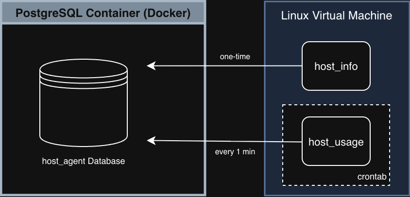

# Linux Cluster Monitoring Agent Report

## Introduction

The **Linux Cluster Monitoring Agent** is a lightweight resource monitoring and management solution designed to collect, store, and analyze hardware specifications and real-time system usage across a cluster of Linux machines.

Its primary goal is to provide system administrators, DevOps engineers, and backend developers with a centralized and consistent view of server health. By monitoring key indicators, such as CPU utilization, memory availability, and disk usage, the system helps ensure production environments remain stable and scalable.

The project is implemented using a modular and script-driven architecture:

- **Bash** is used for interacting with the Linux operating system and collecting metrics.
- **PostgreSQL** is used as the centralized data store.
- **Docker** provides an isolated and reproducible database environment.
- **Crontab** automates periodic metric collection.
- **Git/GitHub** manages version control and collaboration.

This project simulates a real-world infrastructure monitoring workflow commonly used in cloud and on-premise environments.

---

## Quick Start

### 1. Create a PostgreSQL Instance

A PostgreSQL database is deployed using Docker. The provided shell script simplifies container lifecycle management.

```bash
# Usage: ./scripts/psql_docker.sh create|start|stop [db_username] [db_password]

sudo ./scripts/psql_docker.sh create rocky 1234
sudo ./scripts/psql_docker.sh start
```

This will:

- Pull the official PostgreSQL image
- Create a container named `jrvs-psql`
- Create database user `rocky` with password `1234`

---

### 2. Initialize Database Schema

Once the container is running, create a database and initialize the database schema using the DDL script.

```bash
psql -h localhost -U rocky -W
CREATE DATABASE host_agent;
```

```bash
psql -h localhost -U rocky -d host_agent -f sql/ddl.sql
```

This script creates all required tables and relationships for the monitoring agent.

---

### 3. Insert Hardware Specifications

Run the `host_info.sh` script **once per host**. This script collects static hardware information that rarely changes.

```bash
bash scripts/host_info.sh localhost 5432 host_agent rocky 1234
```

Examples of collected data:

- Hostname
- CPU architecture
- Number of CPU cores
- Total memory

 ---

### 4. Insert Host Usage Data

Run the `host_usage.sh` script **periodically** to collect host resource usage metrics.

```bash
bash scripts/host_usage.sh localhost 5432 host_agent rocky 1234
```
Examples of collected data:

- Timestamp
- Host ID
- Memory free
- CPU idle
- CPU kernel

---

### 5. Schedule Periodic Usage Collection

To continuously track system usage, configure a Crontab to run the usage script every minute.

```bash
crontab -e
```

Add the following entry:

```bash
* * * * * bash /home/rocky/dev/linux_sql/scripts/host_usage.sh localhost 5432 host_agent rocky 1234 > /tmp/host_usage.log
```

This enables automatic ingestion of runtime metrics without manual intervention.

---

## Implementation

The project was implemented in a modular and incremental manner to ensure clarity, scalability, and automation.

### System Architecture

The system uses the following architecture:

- Each Linux host runs lightweight monitoring scripts.
- All data is pushed to a centralized PostgreSQL database.



This design allows horizontal scalability to multiple nodes.

---

### Scripts Overview

#### `psql_docker.sh`

Manages the PostgreSQL Docker container.

Supported commands:

```bash
./scripts/psql_docker.sh create [username] [password]
./scripts/psql_docker.sh start
./scripts/psql_docker.sh stop
```

Responsibilities:

- Create PostgreSQL container
- Start or stop the database
- Enforce consistent database configuration

---

#### `host_info.sh`

Collects **static host information** and inserts it into the `host_info` table.

Collected metrics include:

- Hostname
- CPU core count
- CPU architecture
- Total memory (KB)

This script is intended to run once during host initialization.

---

#### `host_usage.sh`

Collects **dynamic runtime metrics** and inserts records into the `host_usage` table.

Metrics collected:

- Timestamp
- Free memory
- CPU idle percentage
- Disk usage

This script is designed to be executed repeatedly via Crontab.

---

## Database Design

### Table: `host_info`

Stores static hardware metadata.

| Column Name       | Data Type        | Description                        | Constraints         |
|------------------|-----------------|------------------------------------|-------------------|
| id               | SERIAL           | Unique host identifier             | PRIMARY KEY        |
| hostname         | VARCHAR          | Unique host name                   | UNIQUE             |
| cpu_number       | SMALLINT         | Number of CPU cores                | NOT NULL           |
| cpu_architecture | VARCHAR          | CPU architecture                   | NOT NULL           |
| cpu_model        | VARCHAR          | CPU model name                     | NOT NULL           |
| cpu_mhz          | DOUBLE PRECISION | CPU frequency in MHz               | NOT NULL           |
| l2_cache         | INTEGER          | L2 cache size in KB                | NOT NULL           |
| timestamp        | TIMESTAMP        | Record timestamp                   | NULLABLE           |
| total_mem        | INTEGER          | Total memory in KB                 | NULLABLE           |

---

### Table: `host_usage`

Stores time-series resource usage data.

| Column Name      | Data Type        | Description                            | Constraints                        |
|-----------------|-----------------|----------------------------------------|-----------------------------------|
| timestamp       | TIMESTAMP        | Record timestamp                        | NOT NULL                          |
| host_id         | SERIAL           | Host identifier                          | NOT NULL, FOREIGN KEY host_id |
| memory_free     | INTEGER          | Free memory in KB                        | NOT NULL                          |
| cpu_idle        | SMALLINT         | CPU idle percentage                       | NOT NULL                          |
| cpu_kernel      | SMALLINT         | CPU time spent in kernel mode (%)        | NOT NULL                          |
| disk_io         | INTEGER          | Disk I/O in KB/s                          | NOT NULL                          |
| disk_available  | INTEGER          | Available disk space in KB                | NOT NULL                          |


A foreign key constraint ensures referential integrity between hosts and usage records.

---

## Testing

The system was tested locally on a Linux environment using the following methods:

### DDL Testing

- Executed `ddl.sql` using psql
- Verified table structure using `\d host_info` and `\d host_usage`

### Test host_info.sh

- Manually executed `host_info.sh`
- Verified data insertion via SQL queries

```sql
SELECT * FROM host_info;
```

### Test host_usage.sh

- Configured Crontab to run every minute
- Monitored `/tmp/host_usage.log`
- Verified new rows were inserted continuously

```sql
SELECT COUNT(*) FROM host_usage;
```

---

## Deployment

- **Database Layer:** PostgreSQL deployed via Docker
- **Monitoring Layer:** Bash scripts running on each Linux node
- **Automation:** Crontab scheduler
- **Version Control:** Git and GitHub repository

This setup closely mirrors real-world DevOps monitoring pipelines.

---

## Limitations

- No real-time alerting mechanism
- No visualization dashboard
- Manual log inspection required

---

## Future Improvements

1. **Alerting System**  
   Integrate Slack Webhooks or email notifications when predefined thresholds are exceeded.

2. **Improved Error Handling**  
   - Validate script arguments
   - Use `pg_isready` to confirm database availability
   - Implement structured logging

3. **Monitoring Dashboard**  
   Connect PostgreSQL to Grafana to visualize trends and system health metrics.

4. **Cloud Deployment**  
   Extend the solution to support AWS EC2 or GCP VM clusters.

---

## Conclusion

The Linux Cluster Monitoring Agent demonstrates a practical, production-inspired approach to infrastructure monitoring using foundational DevOps tools. Through Bash scripting, containerization, and relational data modeling, the project showcases how lightweight agents can provide powerful operational visibility across distributed systems.

